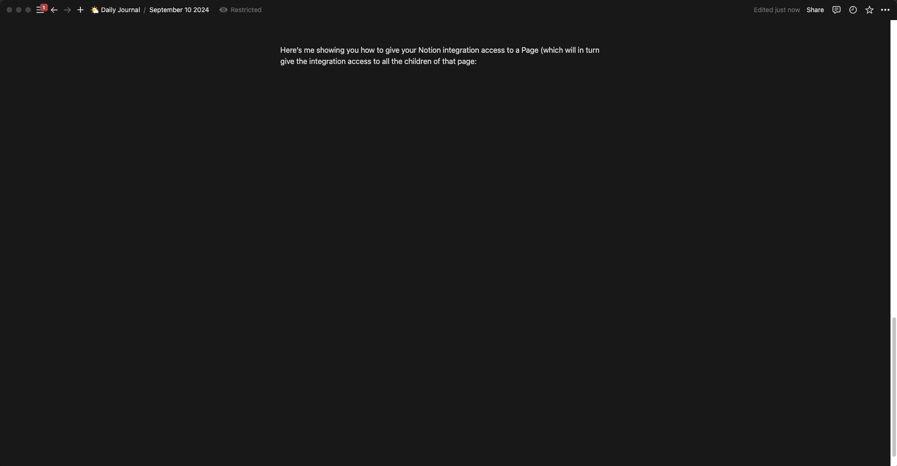

# notion-cli-rs

A dead simple CLI for fetching data from Notion

Mostly used for helping debug [Dross](https://github.com/Melvillian/dross)

## Getting Started

1. Follow the instructions for creating an [internal Notion integration here](https://www.notion.so/help/create-integrations-with-the-notion-api#create-an-internal-integration)
2. Add the integration to the Notion Pages you want this CLI to have access to by following along with this gif:
    
3. Run `cp .env.example .env` and fill in the envvar values.
4. `cargo run -- --help`
5. Profit!